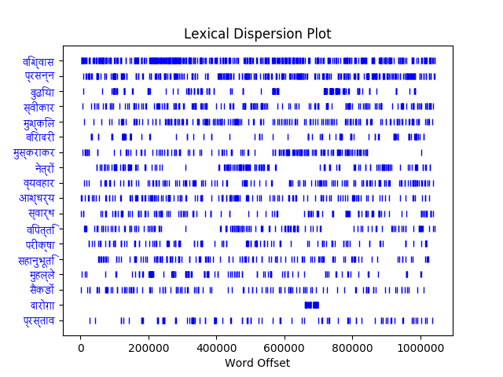
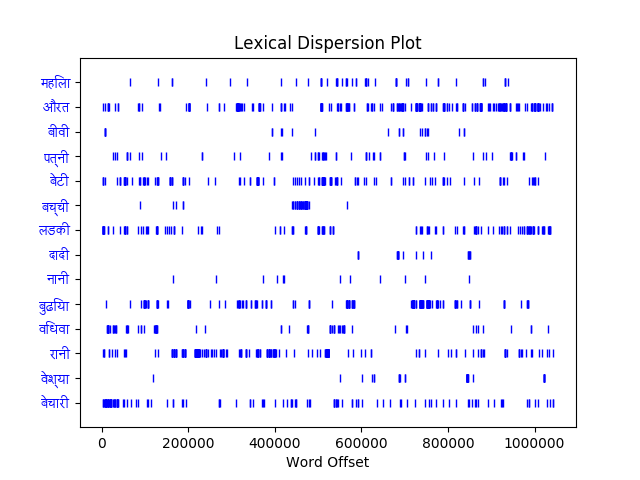
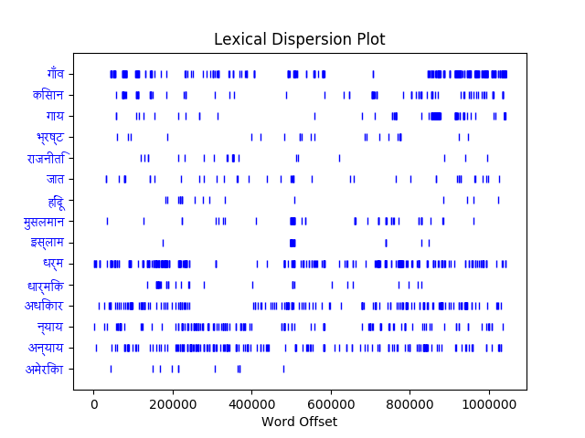
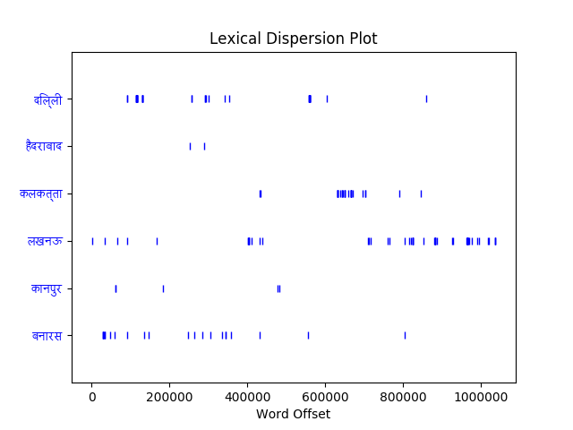

# premchand_nltk

This project is an exploratory analysis of vocabulary choice in the works of Premchand (1880 - 1936) -- specifically, his works in Hindi. I used tools from the Python NLTK toolkit to analyze a hand-picked corpus of over 1 million words.

  

Premchand was a prolific Hindi-Urdu writer. His works include more than a dozen novels, around 250 short stories, several essays and translations of a number of foreign literary works into Hindi. The works included in the corpus for this project are:

  

1907

- प्रेमा (novel) 

1910

- बड़े भाई साहब 
- दूध का दाम 

1912

- वरदान (novel) 

1915

- बेटी का धान 
- सौत 

1916

- सज्जनता का दंड 

1917

- इस्वरिया न्याय 
- दुर्गा मंदिर 
- उपदेश 

1918

- बलिदान 

1920

- दो क़ब्रें 
- मनुष्य का परम धर्म 
- बेटोंवाली विधवा 

1921

- माँ 
- बूढ़ी काकी 
- सवा सेर गेहूँ 
  
  

1922

- मुक्ति मार्ग 
- वज्रपात 
- भाड़े का टट्टू 
- मृतक-भोज 

1923

- परीक्षा 
- प्रेम का उदय 
- सत्याग्रह 
- सुहाग की साड़ी 
- ख़ून सफ़ेद 
  

1924

- रंदभूमि (novel) 
- शतरंग के खिलाड़ी 
- ठाकुर का कुआँ 

1925

- निर्मला (novel) 
- धिक्कर 
- नामक का धरोग 
- हार की जीत 
- प्रेरणा 
- सती 

1926

- दिल की रानी 
- हिंसा परम धर्म 
- बड़े घर की केटी 
- भूत 
- निमंत्रण 
- रामलीला 

1927

- प्रतिज्ञा (novel) 
- मंदिर 

1928

- ममता 

1929

- लांछन 
- घासवाली 

1930

- पूस की रात 
- जुलूस 
- समर-यात्रा 

1931

- ग़बन (novel) 
- जेल 

1932

- कर्मभूमि (novel) 
- मनोवृत्ति 

1933

- ईदगाह 

1934

- नशा 

1936

- गोदान (novel) 
- कफ़न 
  
  
  

The project made use of several NLTK tools, including collocations -- almost all of which were multi-word verb constructions, two-part names, or names/titles followed by honorifics. This provided an interesting contrast to English, where these types of constructions are much less common. Therefore, the collocation searcher was much less useful on a Hindi text than it would be on an English text.

  

Another NLTK tool utilized in this project was FreqDist(). The code queries the corpus for all of the words of 6 characters or more which appear in the top 1,000 most frequent words in the corpus. From this result, I isolated those words which appeared at least 100 times, and from that list discarded words such as pronouns, simple verbs, and other grammatical constructions that did not give much information about the content of the text. The list I was left with looked like this:

  

विश्वास occurs 456 times. (Belief)

प्रसन्न occurs 298 times. (Glad)

बुढ़िया occurs 204 times. (Old woman)

स्वीकार occurs 190 times. (Acceptance)

मुश्किल occurs 177 times. (Difficult)

बिरादरी occurs 162 times. (Community)

मुस्कराकर occurs 157 times. (Smiling)

नेत्रों occurs 154 times. (Eyes)

व्यवहार occurs 151 times. (Behavior)

आश्चर्य occurs 148 times. (Surprise)

स्वार्थ occurs 140 times. (Selfishness)

विपत्ति occurs 131 times. (Disaster)

परीक्षा occurs 129 times. (Test/exam)

सहानुभूति occurs 127 times. (Sympathy)

मुहल्ले occurs 117 times. (Neighborhood)

सैकड़ों occurs 112 times. (Hundreds (of))

दारोग़ा occurs 111 times. (Police/warden/inspector (rural slang))

प्रस्ताव occurs 106 times. (Offer)

  

Here is a dispersion plot of these frequently-appearing content words:

Interestingly, I found that the word “दारोग़ा,” although it occurs with high frequency in the corpus, is actually only found in one of the chosen works (the novel ग़बन).

  
  

Other dispersion plots also yielded interesting results:

This dispersion plot analyzed Premchand’s use of words to describe women. An interesting distinction is his use of “महिला” vs. “औरत” -- Premchand seems to prefer the no-nonsense, mundane “औरत” over its sweeter, more polite counterpart. Similarly, he seems to favor the more everyday “पत्नी” to the slightly nicer “बीवी.” It is also worth noting that his use of “बेचारी” dropped significantly after his early works, as he became more adept in writing about the issues of poor and marginalized communities without simply looking upon them with pity.

  
  

This plot analyzed the changes in Premchand’s use of vocabulary related to social issues over time. It is worth noting that his use of words such as “गाँव,” “किसान,” and “गाय” increased greatly in his later work, when he began to focus more on the issues of the rural poor. Words which remain prevalent throughout the corpus are, unsurprisingly, “धर्म/धार्मिक,” “अधिकार,” and “न्याय/अन्याय.” Out of curiosity, I also searched for “America” in the corpus, and was intrigued to find its use limited to the first half of the texts.

  
  

This dispersion plot of mentioned place names was primarily an attempt to see if Premchand’s own geographical location had much effect on his writing (He moved from Banaras to Kanpur at age 25, then later to Gorakhpur before retiring back in Banaras). This plot is sparse, likely because the place names chosen are of large towns and cities and Premchand’s work usually focused more on rural life. However, it is interesting to note that Premchand mentioned Banaras, his hometown, more frequently in the first half of his career, and seemed to feature the nearby city of Lucknow more often in his later works. The small cluster of mentions of Kolkata corresponds roughly to his novel, “Nirmala.”
